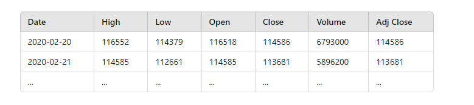
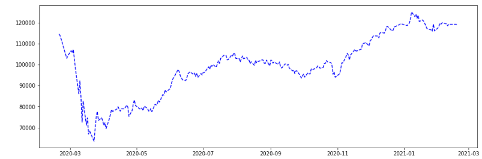
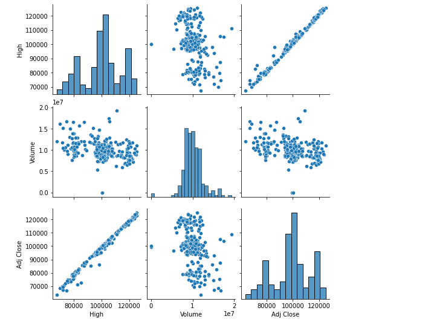

# Gráficos Criados pelo Python dentro do Power BI

Este guia orienta sobre como criar gráficos no Power BI usando Python, incluindo a configuração do ambiente virtual, a instalação das bibliotecas necessárias e a criação dos gráficos.

## Passos para Configuração

### 1. Criar Ambiente Virtual com Python 3.6

1. **Instalar o virtualenv** (caso não esteja instalado):
   ```sh
   pip install virtualenv

### 2. Ativando um ambiente virtual: 
   virtualenv -p python3.6 venv

    1. Ativar o ambiente virtual:
    
    No Windows:

    .\venv\Scripts\activate

    2. Instalar Bibliotecas Necessárias
        pip install matplotlib seaborn pandas openpyxl jupyter

    3. Sincronizar o Ambiente Virtual com o Power BI
        Abra o Power BI.
        Vá para Arquivo > Opções e configurações > Opções.
        No menu lateral, selecione Python scripting.
        No campo de Python home directories, selecione o diretório do seu ambiente virtual (venv).

### 3. Criar os Gráficos

Exemplo de Código para Gráfico no Power BI
Aqui estão dois exemplos de gráficos criados com Python:

Importar o Dataset:
    import pandas as pd
    import matplotlib.pyplot as plt

    dataset = pd.read_excel("Cotacoes.xlsx", engine='openpyxl')
    display(dataset)



Gráfico Matplotlib:

    import matplotlib.pyplot as plt

    plt.figure(figsize=(15, 5))
    plt.plot(dataset["Date"], dataset["Adj Close"], "b--")
    plt.show()



Gráfico Seaborn:

    import matplotlib.pyplot as plt
    import seaborn as sns

    sns.pairplot(dataset[["Date", "High", "Volume", "Adj Close"]])
    plt.show()





